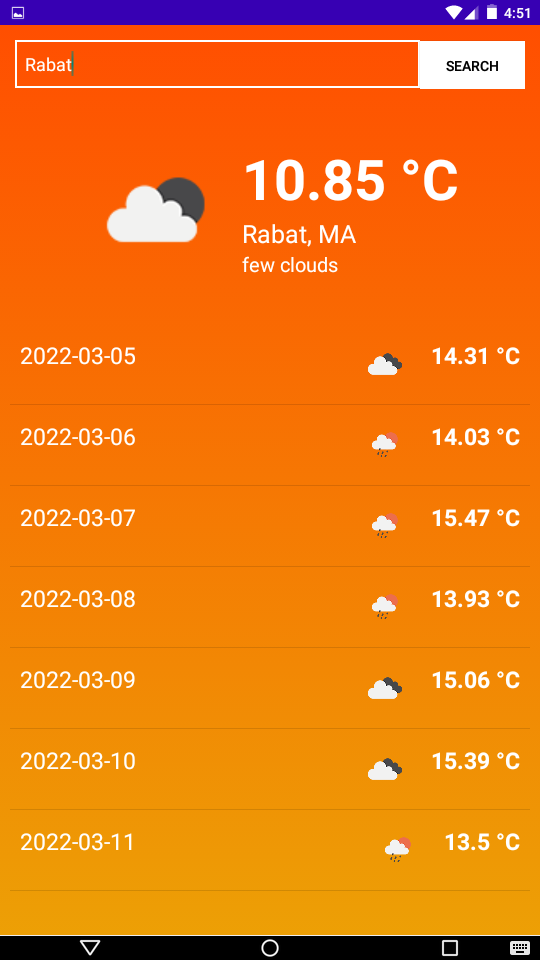
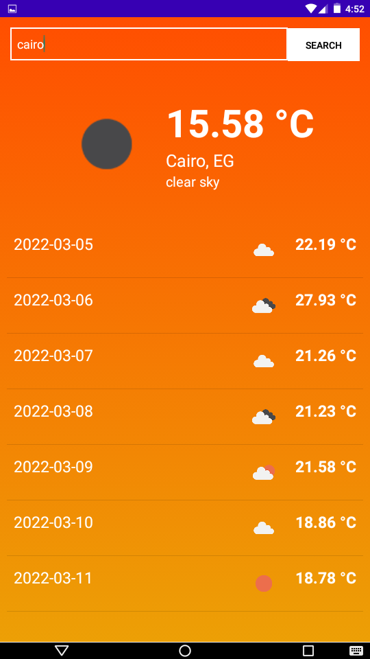

# MyWeather

A simple practical weather forecast application.

Using the famous [OpenWeatherAPI](https://openweathermap.org/).
And the beautiful [Ion library](https://github.com/koush/ion).

## final product (not hh)

.
.
